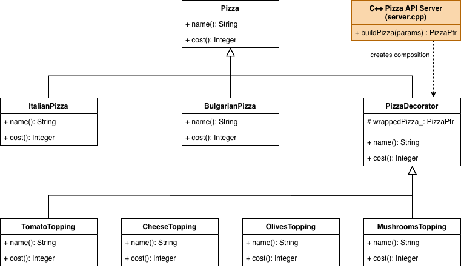

# Отчёт по лабораторной работе №2

## «Применение паттерна Декоратор в веб-приложении Пиццерия (C++)»

### 1. Введение

Цель работы: реализовать структурный паттерн проектирования **Декоратор** в реалистичном веб-приложении с C++ бизнес-логикой.

Предметная область: конструктор пиццы.

- Есть базовые пиццы: итальянская и болгарская.
- Есть набор добавок: томаты, сыр, оливки, грибы.
- Стоимость итогового заказа зависит от комбинации выбранных добавок.

### 2. Проблема без паттерна

Если реализовать добавки без паттернов, обычно появляются классы для каждой комбинации:

- ItalianWithTomato
- ItalianWithCheese
- ItalianWithTomatoAndCheese
- BulgarianWithTomatoAndCheeseAndOlives
- и т.д.

При росте числа добавок число классов резко увеличивается. Такой подход неудобен для сопровождения и нарушает принцип открытости/закрытости.

### 3. Суть паттерна «Декоратор»

Паттерн позволяет динамически расширять функциональность объекта, оборачивая его в объекты-декораторы с тем же интерфейсом.

Участники в проекте (вариант `web/`):

- **Component**: `Pizza`
- **ConcreteComponent**: `ItalianPizza`, `BulgarianPizza`
- **Decorator**: `PizzaDecorator`
- **ConcreteDecorator**: `TomatoTopping`, `CheeseTopping`, `OlivesTopping`, `MushroomsTopping`
- **Client**: C++ backend, который формирует заказ по параметрам из веб-формы

### 4. Реализация в приложении

1. Пользователь открывает веб-страницу и выбирает базу/добавки.
2. Frontend отправляет параметры на C++ endpoint `/api/pizza`.
3. Backend в варианте `web/` последовательно оборачивает базовую пиццу в декораторы.
4. Frontend отображает название, стоимость и визуальные слои пиццы.

Пример цепочки:

- `BulgarianPizza`
- `TomatoTopping(BulgarianPizza)`
- `CheeseTopping(TomatoTopping(BulgarianPizza))`

### 5. Почему это решение лучше

- Добавление новой добавки не требует изменения существующих классов пицц.
- Снижается связность между клиентом и конкретными комбинациями ингредиентов.
- Избегается взрыв количества классов при росте числа опций.
- Поведение собирается во время выполнения, что особенно удобно для GUI-конструкторов.

### 6. Вариант без паттерна

Для сравнения реализован отдельный проект `web_without_pattern/`.

- Логика также находится в C++, но реализована через прямые `if`-условия.
- Название и цена считаются функциями `buildName` и `buildPrice`.
- Расширение функциональности требует изменения существующего кода, в отличие от версии с декораторами.

### 7. Вывод

Паттерн **Декоратор** в данной работе применён по назначению: он позволяет наглядно формировать состав пиццы и её стоимость в веб-приложении при C++ бизнес-логике. Наличие второй версии без паттерна демонстрирует, что решение с декораторами лучше масштабируется и проще расширяется.

### 8. UML диаграмма классов

Диаграмма классов, отражающая применение паттерна «Декоратор»

На диаграмме отражены классы и их связи. Соответствие ролям паттерна следующее:

- Component: `Pizza`
- ConcreteComponent: `ItalianPizza`, `BulgarianPizza`
- Decorator: `PizzaDecorator`
- ConcreteDecorator: `TomatoTopping`, `CheeseTopping`, `OlivesTopping`, `MushroomsTopping`
