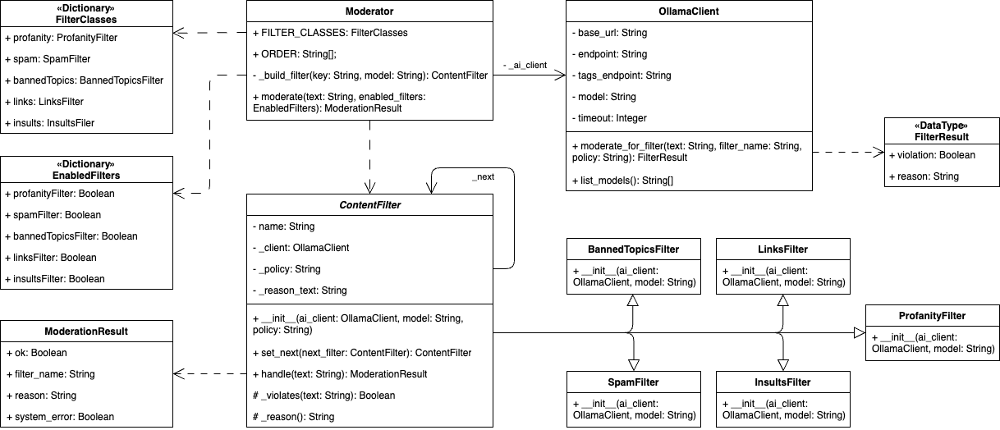

# Лабораторная работа №3

## Тема

Модератор контента с несколькими фильтрами.

Идея: браузер отправляет текст и выбранные фильтры на API, сервер собирает цепочку обработчиков и гонит сообщение по цепочке до первого нарушения.

## Архитектура проекта

1. Backend на Flask: app.py
2. HTML-шаблон интерфейса: index.html
3. Клиентская логика (fetch + рендер результата): app.js
4. Стили интерфейса: styles.css
5. Зависимости: requirements.txt

## Применённый паттерн

Использован паттерн **Chain of Responsibility (Цепочка обязанностей)**.



Цепочка фильтров:

1. Проверка на мат (ИИ)
2. Проверка на спам (ИИ)
3. Проверка на запрещённые темы (ИИ)
4. Проверка на ссылки (ИИ)
5. Проверка на оскорбления (ИИ)

Каждый фильтр:

- анализирует сообщение;
- при нарушении возвращает ошибку и останавливает цепочку;
- при отсутствии нарушения передаёт сообщение следующему фильтру.

В коде цепочка выражена явно через отдельные классы-обработчики:

- `ContentFilter` — абстрактное звено цепочки;
- `ProfanityFilter`;
- `SpamFilter`;
- `BannedTopicsFilter`;
- `LinksFilter`;
- `InsultsFilter`.

Все конкретные обработчики используют общий ИИ-клиент (`OllamaClient`), но остаются самостоятельными звеньями Chain of Responsibility.

Состав цепочки формируется динамически на основе состояния флажков в GUI, без изменений основного кода модерации.

### Настройка ИИ-модерации

Все фильтры используют: `Ollama`.

1. Установите Ollama (macOS):

```bash
brew install ollama
```

1. Запустите Ollama-сервер:

```bash
ollama serve
```

2. Скачайте модель (пример):

```bash
ollama pull llama3.2:3b
```

Если Ollama недоступен, сообщение отклоняется с причиной ошибки подключения.

## Запуск

1. Перейти в каталог `lab03`.
1. Установить зависимости:

```bash
python3 -m pip install -r requirements.txt
```

1. Запустить сервер:

```bash
python3 app.py
```

1. Открыть в браузере:

```text
http://127.0.0.1:8080
```
