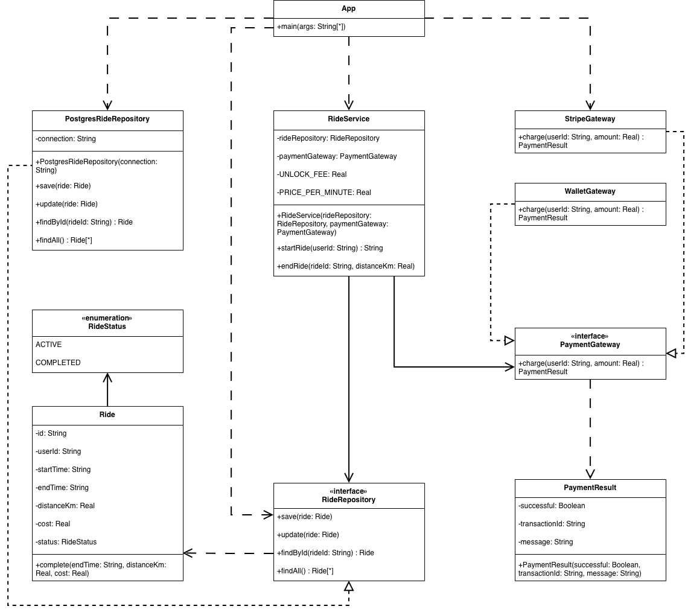

# Лабораторная работа №4

## Тема

Система аренды электросамокатов (City E-Scooter Rental).

Идея: Разделение бизнес-логики (core) и деталей реализации инфраструктуры (база данных, платежные шлюзы) для обеспечения высокой гибкости и тестируемости.

## Архитектура проекта

Проект реализован на языке Java и разделен на несколько Maven-модулей:

1. `scooter-core`: Ядро системы. Содержит доменные модели (`Ride`), бизнес-логику (`RideService`) и интерфейсы-порты (`RideRepository`, `PaymentGateway`). Не имеет внешних зависимостей.
2. `scooter-postgres`: Инфраструктурный модуль. Реализует интерфейс `RideRepository` для работы с базой данных PostgreSQL через JDBC.
3. `scooter-gateways`: Инфраструктурный модуль. Содержит реализации `PaymentGateway` для различных платежных систем (Stripe, внутренний кошелек).
4. `scooter-app`: Слой приложения. Связывает реализации инфраструктуры с ядром через Dependency Injection и запускает Web-сервер (Javalin).

## Применённый паттерн

Использован паттерн **Separated Interface (Разделение интерфейса)**.



Основные принципы:

- Ядро (`scooter-core`) диктует контракты (интерфейсы), которые ему необходимы для работы.
- Оно не знает о существовании PostgreSQL или Stripe.
- Реализации находятся в отдельных модулях, что позволяет легко менять способ хранения данных или провайдера платежей без изменения бизнес-логики.

В коде инверсия зависимостей реализована через конструктор:

```java
// RideService зависит только от интерфейсов
public RideService(RideRepository rideRepository, PaymentGateway paymentGateway) {
    this.rideRepository = rideRepository;
    this.paymentGateway = paymentGateway;
}
```

## Реализация без паттерна

В каталоге `without-pattern/` представлена версия приложения, где вся логика (API, бизнес-правила, SQL-запросы, оплата) перемешана в одном модуле и даже в одном классе.

Проблемы такой реализации:
- **Сильная связность (Tight Coupling):** Код бизнес-логики напрямую зависит от JDBC и конкретных библиотек.
- **Сложность тестирования:** Невозможно протестировать расчет стоимости поездки без запущенной базы данных.
- **Нарушение Single Responsibility Principle:** Класс `App` отвечает и за HTTP-роутинг, и за логику поездок, и за интеграцию с БД.

## Настройка окружения

Для работы приложения необходима база данных PostgreSQL.

1. Запустите базу данных через Docker Compose:
```bash
docker compose up -d
```
Скрипт `schema.sql` автоматически создаст необходимые таблицы при первом запуске.

## Запуск

1. Перейти в каталог `lab04`.
2. Собрать проект и запустить основное приложение:
```bash
mvn clean compile exec:java -pl scooter-app
```
3. Для запуска версии без паттерна (на другом порту 7071):
```bash
mvn clean compile exec:java -pl without-pattern
```

Интерфейс приложения будет доступен по адресу: `http://localhost:7070`.
